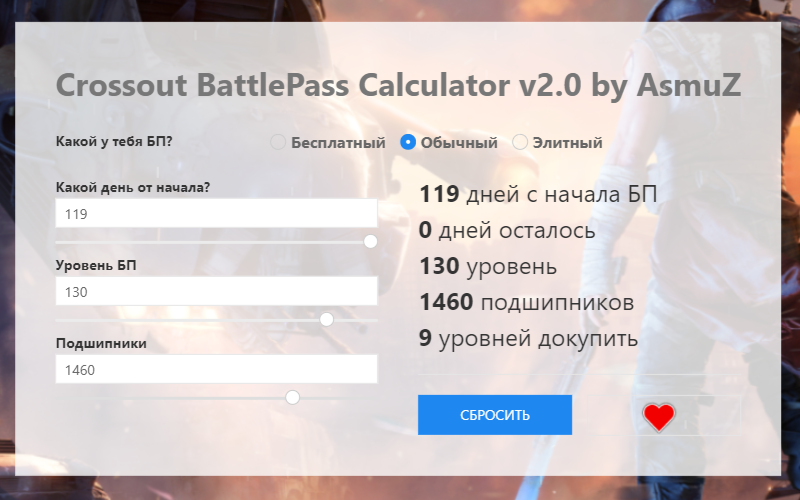

# Crossout BattlePass Calculator v2.0 by AsmuZ

Этот простой на вид калькулятор позволяет наглядно увидеть зависимость трёх полей:

- Дней
- Уровней
- Подшипников

В зависимости от типа БП (бесплатный, простой , элитный).

Т.е. ты просто берешь и перетягиваешь любой из «ползунков» и видишь как при этом меняются остальные.

Можно легко понять что нужно для получения конкретного количества подшипников. Причем калькулятор даже покажет сколько уровней нужно докупить с случае необходимости.

### [Открыть калькулятор](https://crossout-bp.asmuz.ru) на сайте.
